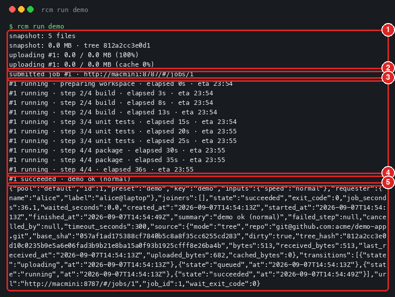
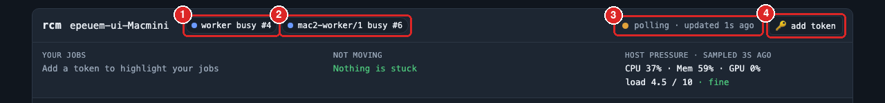
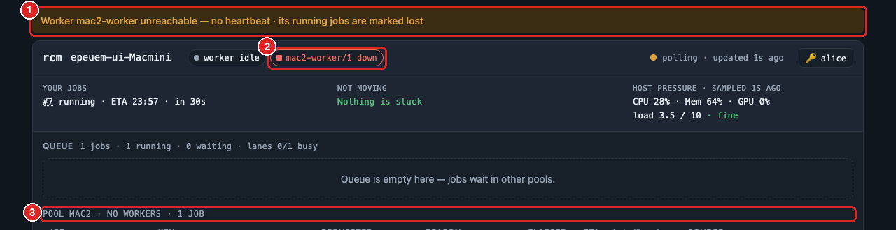
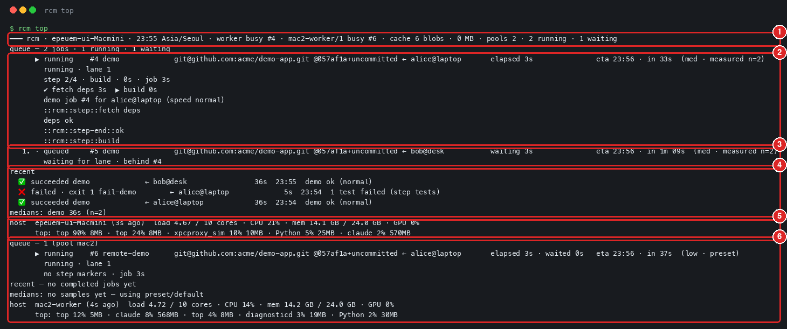
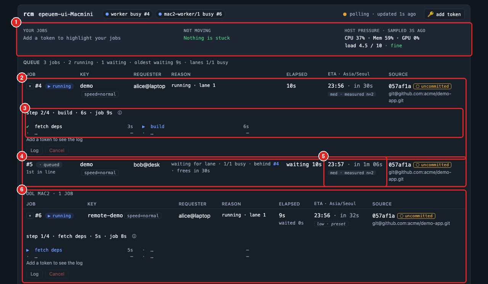
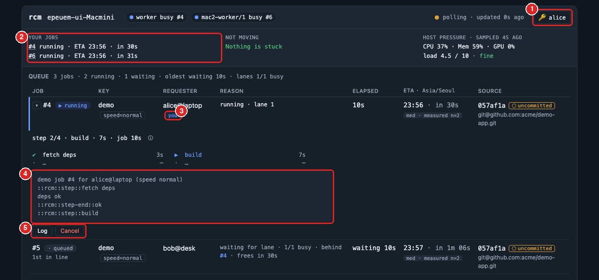
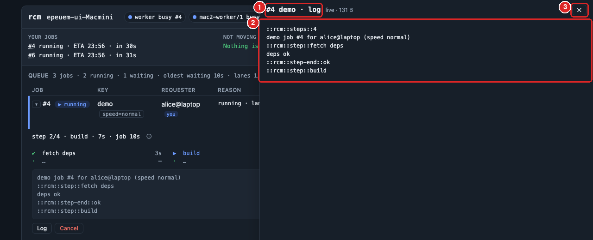
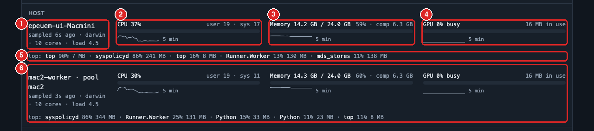
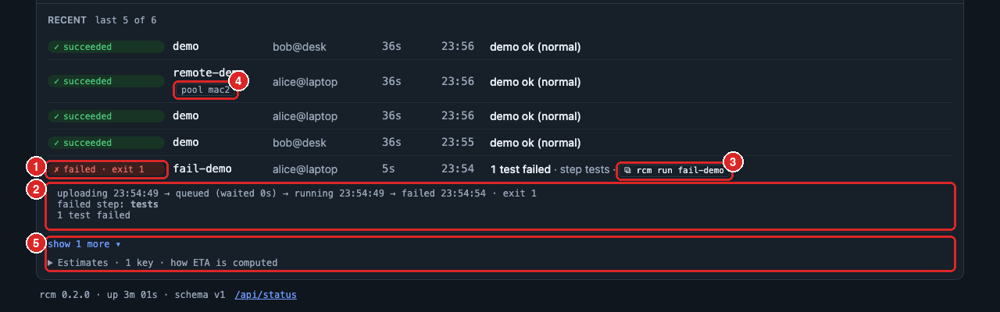
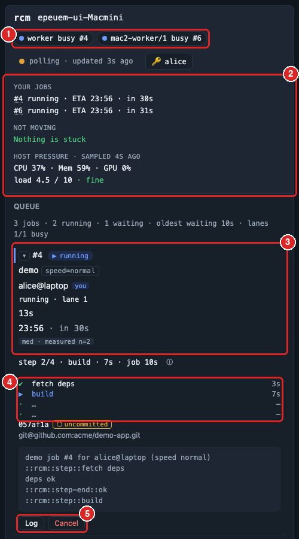

# remote_ci_monitor

English: [README.md](README.md)

빌드 머신 **한 대**를 팀이 나눠 쓰기 위한 로컬 잡 서버. 어느 컴퓨터의 세션이든 프리셋을 제출하면
(`rcm run gate`) 서버가 큐에 넣어 한 번에 하나씩 실행하고, 대기 순번 · ETA · 스텝 진행 · 호스트
부하를 보여 주고, 결과를 **종료 코드**로 돌려준다.

- GitHub 에 의존하지 않는다. LAN 이나 Tailscale 안에서 돈다.
- 런타임 의존성 **0**(Python 3.11+ 표준 라이브러리만). 서버와 클라이언트가 같은 패키지다.
- 빌드 머신은 macOS(Apple Silicon · Intel)와 Linux. Windows 는 범위 밖이다(Windows 의 세션은 WSL 로 제출한다).
- 세션은 **작업 트리를 있는 그대로**(미커밋 변경 포함) 올린다. 게이트가 초록이면 *이* 트리가 통과한 것이다.

Status: **M0–M5 done (v0.2.2)** — 서버 · 큐 · 워커 · 실시간 이벤트 · 웹 UI · `git_ref` 배포 · 보존
정리 · 서비스 파일 · 패키징 · 우선순위 · 스냅샷 캐시 · 알림 · 워커 풀 · 원격 워커(`rcm worker`).
GitHub 백엔드는 없고 계획도 없다. GitHub 은 커밋 · 푸시 · PR 머지 전용이다. 계획서는 `PLAN.md`,
변경 이력은 `CHANGELOG.md`.

## Install

두 머신 모두 Python **3.11.4+**(안전한 `tarfile` 필터)가 필요하다. 패키지 하나, 런타임 의존성 없음:

```sh
pipx install git+https://github.com/monocsp/remote_ci_monitor   # from git (main) — the way to install until the first PyPI release; add @dev for the dev branch
pipx install remote-ci-monitor                      # from PyPI (not published yet — see Releasing)
uvx --from remote-ci-monitor rcm version            # or run it through uv without installing (uv: https://docs.astral.sh/uv/getting-started/installation/)
```

`pipx` 가 없으면 `python3 -m pip install --user pipx && python3 -m pipx ensurepath` 뒤 새 셸을 연다.
설치 직후 `rcm` 이 "command not found" 면 `~/.local/bin` 이 아직 `PATH` 에 없는 것이다 —
`pipx ensurepath` 뒤 새 셸. GitHub Releases 페이지의 wheel 도 `pipx install <wheel-url>` 로 설치된다.

## Build machine (3 commands)

```sh
rcm init server            # writes ~/.config/rcm/server.toml — edit presets and the bind address
rcm token add laptop       # prints the token ONCE; hand it to that session machine
rcm serve                  # http://127.0.0.1:8787 · Ctrl-C or SIGTERM stops it cleanly
```

화면에 보이는 것:

- `rcm init server` → 만들어진 `~/.config/rcm/server.toml` 경로 한 줄. 이 파일에 프리셋과 `bind` 를 적는다.
- `rcm token add laptop` → `token 'laptop' created — shown once …` 다음 줄이 토큰이다. **이때 한 번만**
  보이므로 복사해서 세션 머신에 넘긴다. 서버에는 해시만 남아 다시 볼 수 없다.
- `rcm serve` → `[rcm] rcm 0.2.0 listening on http://127.0.0.1:8787 · lanes 1 · presets ok, gate, …`
  한 줄. 이 상태로 두면 된다.

생성된 설정에는 무해한 `ok` 프리셋이 들어 있어 자기 프리셋을 쓰기 전에 전체 경로를 끝까지 확인할 수
있다. 다른 컴퓨터의 세션을 받으려면 `bind` 를 그 머신의 Tailscale/LAN 주소(또는 `0.0.0.0`)로
바꾸고, macOS 에서는 방화벽 프롬프트에서 Python 을 허용한다. 다른 컴퓨터에서
`curl http://<build-machine>:8787/api/health` 로 확인한다. 로그인 · 재부팅을 넘기는 서비스는
[Run as a service](#run-as-a-service).

토큰: `rcm token add ops --admin` 은 관리자 토큰(정지/재개, 아무 잡이나 취소, 아무 로그나 읽기)을
만든다. `rcm token list` 는 비밀을 보여 주지 않는다. `rcm token revoke NAME`. 다른 포트는
`rcm serve --port 8790`(또는 server.toml 의 `port = …`). `0.0.0.0` 에 바인드하면
`public_url = "http://macmini:8787"` 을 두어 `rcm run` 출력의 잡 URL 이 다른 컴퓨터에서도 열리게 한다.

`bind` 를 루프백이 아닌 주소로 두면 서버는 같은 네트워크에 자신을 광고한다(`_rcm._tcp`, mDNS/DNS-SD —
`advertise = false` 로 끄고 `advertise_name` 으로 이름을 바꾼다). 그러면 같은 네트워크의 세션은
`rcm discover` 로 서버를 보거나, 아무것도 안 해도 `rcm run` 이 찾는다.

## Session machine (3 commands)

빌드 머신과 **같은 Wi-Fi/LAN** 이면 주소를 몰라도 된다: `server` 를 비워 두면(또는 `server = "auto"`)
`rcm` 이 mDNS/DNS-SD 로 서버를 찾는다(`rcm discover` 가 보이는 서버를 나열한다). 다른 네트워크에서는
길이 필요하다 — Tailscale 이든 직접 둔 터널이든 — 그러면 서버 주소를 `client.toml` 에 적는다. 서버가
루프백에만 묶여 있으면 광고하지 않는다(`advertise = false` 로 명시적으로 끌 수도 있다).

```sh
rcm init client --server http://<build-machine>:8787   # ~/.config/rcm/client.toml (mode 600)
export RCM_TOKEN=<token from rcm token add>            # or put it in that file as token = "…"
rcm check                  # python · server · token · presets · timezone must all say ok
cd ~/src/app               # any project directory — rcm run uploads the *current directory*
rcm run ok                 # first job: exit 0 and one JSON line means everything works
rcm top                    # queue, ETAs, recent results, host load
```

`rcm check` 는 행마다 `ok` 또는 `FAIL` 을 찍는다(`python` · `server` · `token` · `presets` ·
`timezone` · `pools`). 하나라도 `FAIL` 이면 그 행에 적힌 설명대로 고친 뒤 다시 돌린다.

그다음 프로젝트 디렉터리에서 실제 작업을 돌린다: `cd ~/src/app && rcm run gate -f scope=full`,
그리고 `$?` 로 분기 — 0 성공 · 1 실패 · 2 취소/타임아웃 · 3 모름. `examples/session/ci-gate.sh` 가
`$?` 로 분기하는 래퍼다(`jq` 필요).



- ① 스냅샷과 업로드 — 파일 수, 트리 해시, 서버가 이미 가진 파일은 건너뛴 비율(`cache`)
- ② `submitted job #1 · <URL>` — 잡 번호와 웹 주소. 이 번호로 `rcm wait --job 1` · `rcm cancel 1` · `rcm logs 1`
- ③ 진행 줄(stderr) — 상태 · 순번 또는 스텝 · 경과 · ETA. 터미널에서는 한 줄이 덮어써지고, 파일로 받으면 바뀔 때만 새 줄이 찍힌다
- ④ 종료 한 줄 — 상태와 `summary`
- ⑤ stdout 의 JSON 한 줄 — `state` · `exit_code` · `failed_step` · `summary` · `url` · `wait_exit_code`. 스크립트는 이 줄과 종료 코드만 보면 된다

`rcm run` 은 **현재 디렉터리**를 스냅샷한다(git 추적 파일 + 무시되지 않은 미추적 파일, `.rcmignore`
의 패턴은 제외 — gitignore 문법, 예 `dist/`, `*.bin`; `--exclude PATTERN` 으로 하나 더). 같은 HTTP
연결로 올리고, 기다리고, stdout 에 JSON 한 줄을 찍는다. `max_snapshot_bytes`(기본 512 MB)를 넘는
스냅샷은 올리기 전에 거부된다. 트리 밖을 가리키는 심볼릭 링크(절대 경로 대상, 예 venv 의
`bin/python`)는 이름을 적은 경고와 함께 건너뛴다. 빌드 머신의 워크스페이스에는 **`.git` 이 없다**.
git 이력이 필요한 스크립트는 `git_ref` 프리셋으로 간다(`RCM_BASE_SHA` 는 그대로 커밋을 알려 준다).
진행 표시는 stderr 로 간다. Ctrl-C 는 분리(detach)다 — 잡은 계속 돌고, `rcm wait --job N` 으로 다시
붙거나 `rcm cancel N` 으로 멈춘다.

## Second build machine (remote worker)

프리셋에 풀 이름을 주면(`pool = "linux"`) 다른 머신에서 돌릴 수 있다. 그 머신은 `rcm worker` 를
띄우고, 워커는 서버로 **나가는 방향**으로만 통신한다(NAT 뒤에서도 되고, 서버가 워커에 접속하는 일은
없다):

```sh
# on the server
rcm token add build-02 --worker             # printed once; a worker token only speaks /worker/*
# on the second machine (same rcm release as the server)
export RCM_WORKER_TOKEN=<that token>
rcm worker --server http://macmini:8787 --pool linux --lanes 1 --check   # server · token kind · pool
rcm worker --server http://macmini:8787 --pool linux --lanes 1           # Ctrl-C or SIGTERM stops it
```

`--check` 는 `python` · `server` · `token`(worker) · `pool` · `repos` · `data dir` 행을 찍는다. 전부
`ok` 면 `--check` 를 빼고 띄운다.

워커는 등록한 뒤 레인마다 자기 풀의 대기 잡 하나를 가져가고, 스냅샷을 내려받고(또는 자기
`[[repos]]` 에서 `git_ref` 를 fetch — 옆에 `worker.toml` 을 두고 `--config` 로 넘긴다), 원시 로그를
서버로 흘려보내며(스텝 마커는 서버가 파싱), 결과를 보고한다.



- ① 로컬 워커 — `worker busy #4`(레인이 1 이면 필 하나로 접힌다)
- ② 원격 워커 — `mac2-worker/1 busy #6`(토큰 이름/레인 · 상태 · 잡 번호). 클릭하면 그 잡으로 이동
- ③ 연결 상태 — `live` 는 이벤트 스트림, `polling` 은 10초 폴링. 클릭하면 갱신을 잠시 멈춘다
- ④ 🔑 토큰 버튼([Web UI](#web-ui))

`rcm top` 도 머리줄에 같은 필(`build-02/1 busy #511`)을 보이고, 그 워커의 호스트 표본은 해당 풀 아래에
나온다. 서버가 `worker_timeout_seconds`(60) 동안 heartbeat 을 못 받으면:



- ① 화면 맨 위의 경고 띠 — `Worker mac2-worker unreachable — no heartbeat · its running jobs are marked lost`
- ② 필이 `mac2-worker/1 down` 으로 바뀐다
- ③ 그 풀의 헤더에 `NO WORKERS` — 이 풀의 대기 잡은 `worker down` 이유로 ETA 없이 기다린다

돌던 잡은 `lost`(`worker build-02 unreachable for 61s`)가 되고 다시 시작되지 않는다 — 다시 제출한다.
워커를 정상 종료하면 그 잡은 `lost`(`worker stopped`)로 보고된다. `worker.toml` 의 키: `server` ·
`token`(또는 환경변수) · `pool` · `lanes` · `name` · `data_dir` · `grace_seconds` ·
`keep_workspace_on_failure` · `[host]`(샘플러) · `[[repos]]`. `examples/worker.toml` 참고.
`rcm worker --once` 는 잡 하나만 돌리고 끝난다(cron · 테스트용).

## Presets and step markers

서버는 자기 설정의 **프리셋**만 돌린다. 세션은 프리셋 이름과 입력값만 보내고, 입력은
`RCM_INPUT_<NAME>` 환경변수로 스크립트에 도착한다(명령줄에 끼워 넣지 않는다).

```toml
[[presets]]
name = "gate"
argv = ["bash", "scripts/gate.sh"]      # runs from the uploaded workspace root
pool = "default"                        # worker pool for this preset's jobs (default "default")
pools = []                              # extra pools a session may choose with --pool
timeout_seconds = 1200
expected_seconds = 480                  # used until enough real samples exist
duration_key_inputs = ["scope"]
[[presets.inputs]]
name = "scope"
type = "choice"
choices = ["full", "commit", "fast"]
default = "full"
```

스크립트가 줄 머리에 마커를 찍으면 진행이 화면에 나온다:

```
::rcm::steps::3            # optional: total step count
::rcm::step::analyze       # a new step starts (the previous one ends)
::rcm::step-end::ok        # optional: "ok" or "fail"
::rcm::summary::all green  # optional: one-line result shown in the queue
```

`::rcm::steps::N` 이 있으면 화면에 `step 2/4` 처럼 분모가 확정되고, 없으면 `so far` 가 붙는다.
`step-end::fail` 이 찍힌 스텝(또는 종료 코드가 0 이 아닐 때의 마지막 스텝)이 `failed_step` 이 되어
최근 완료와 JSON 에 남는다. `summary` 는 큐와 최근 완료에 보이는 한 줄 결과다.

자식 프로세스는 stdout 을 버퍼링하므로 마커가 늦게 도착할 수 있다. 타이밍이 중요하면 스크립트에서
`PYTHONUNBUFFERED=1`, `stdbuf -oL`, `flutter --no-color` 같은 플래그를 쓴다. 잡 전체 경과 시간은
항상 정확하다.

### Deploy presets: run a remote ref instead of an upload

게이트는 세션의 작업 트리를 돌린다. 배포 · 릴리스는 **커밋되고 푸시된** ref 를 돌려야 하므로 서버가
직접 fetch 한다(`source_modes = ["git_ref"]`). 저장소를 한 번 선언하고 프리셋이 가리키게 한다:

```toml
[[repos]]
name = "app"
url = "git@github.com:org/app.git"      # any git hosting; uses the build machine's git credentials

[[presets]]
name = "deploy"
argv = ["bash", "scripts/deploy.sh"]
source_modes = ["git_ref"]
repo = "app"                            # optional when exactly one [[repos]] is configured
concurrency_group = "deploy"
```

```bash
rcm run deploy --ref v1.2.3             # branch, tag or full commit sha; nothing is uploaded
```

- 서버는 **제출 시점**에 ref 를 커밋 sha 로 확정하고(`git ls-remote`, 20초 제한) 그 sha 를 돌린다 —
  그 뒤 브랜치가 움직여도 무관하다. 같은 커밋을 두 세션이 제출하면 같은 잡에 합류한다. sha 는 JSON 과
  큐(`app @a1b2c3d · ref main`)에 보인다.
- fetch 는 `<data_dir>/mirrors/<name>/` 의 로컬 미러로 가고, 워크스페이스는 `.git` 이 남은 detached
  체크아웃이라 `git describe` 가 된다. `git submodule` 은 초기화되지 **않는다** — 필요하면 스크립트에서
  `git submodule update --init`.
- ref 는 git 에 닿기 전에 검증된다(앞의 `-` 금지, `..` 금지, 제어문자 금지). 저장소 URL 은 `https://`,
  `ssh://`, `git://`, `file://`, `user@host:path`, 절대 경로만. 스크립트용 env 가 하나 더 있다:
  `RCM_REF`; `RCM_BASE_SHA` 는 고정된 커밋, `RCM_DIRTY=0`.
- `source_modes = ["git_ref"]` 프리셋은 트리 업로드를 거부하고(400), 트리 프리셋에 `--ref` 는 사용
  오류다.

## Session commands

| 명령 | 하는 일 |
|---|---|
| `rcm run PRESET [-f k=v] [--ref REF] [--priority P] [--pool NAME] [--no-cache] [--by LABEL] [--no-join] [--no-wait] [--exclude PATTERN] [--dir DIR] [--timeout S] [--poll]` | 스냅샷 → 제출(같은 활성 잡이 있으면 합류) → 업로드(서버가 캐시하면 바뀐 파일만) → 대기. `--ref` 는 `git_ref` 프리셋용: 스냅샷 없이 서버가 ref 를 fetch. `--priority low\|normal\|high`; `--no-cache` 는 전체 tarball 업로드; `--no-join` 은 같은 잡에 합류하지 않음; `--exclude` 는 `.rcmignore` 패턴 추가; `--dir` 은 다른 디렉터리를 스냅샷 |
| `rcm wait --job N [--timeout S] [--poll]` | 이벤트 스트림으로 잡을 따라가고, 스트림이 거부되면 2초마다 폴링 |
| `rcm eta PRESET [-f k=v] [--priority P] [--pool NAME] [--json]` / `rcm eta --job N` | 큐 순번, 앞선 잡 수, 대기, 예상 소요, 완료 시각, 그 추정의 신뢰도. 이미 실행 중인 잡은 대기 대신 상태와 경과 |
| `rcm top [--watch N] [--json]` | 한 화면: 이유와 ETA 가 붙은 큐, 최근 결과, 중앙값, 호스트 부하(CPU · 메모리 · GPU · 상위 프로세스) |
| `rcm jobs [--mine] [--state S] [--pool NAME] [--json]` | 대기 · 실행 · 최근 잡. `--mine` 은 토큰이 필요하고 합류한 잡도 포함 |
| `rcm logs N [--follow]` | 잡 로그(내 잡, 합류한 잡, 또는 admin 토큰이면 아무 잡) |
| `rcm presets [--json]` | 서버가 제공하는 프리셋과 입력 |
| `rcm discover [--json] [--timeout S]` | 같은 네트워크의 rcm 서버 목록(mDNS). 발견한 서버를 쓴 `rcm check` 는 `(found on this network)` 라고 말한다 |
| `rcm cancel N` · `rcm pause` · `rcm resume` | 취소(합류자는 합류 목록에서만 빠진다) · 큐 정지/재개(admin) |
| `rcm bump N [--priority high]` | 대기 잡의 우선순위 변경(admin) |



- ① 머리줄 — 호스트 · 현재 시각과 시간대 · 워커 필(`worker busy #4` · `mac2-worker/1 busy #6`) · 스냅샷 캐시 · 풀 수 · 실행/대기 수
- ② 실행 중 잡 — 상태 · `#4 demo` · 저장소 `@sha+uncommitted` · 요청자 · 경과 · `eta 23:56 · in 33s (med · measured n=2)`. 아래 줄에 레인, `step 2/4 · build`, 스텝 목록, 로그 tail(토큰이 있을 때)
- ③ 대기 잡 — `1.` 순번 · `waiting 3s` · ETA · 이유 `waiting for lane · behind #4`
- ④ 최근 완료와 중앙값 — ✅/❌ · 키 · 요청자 · 소요 · 시각 · summary(실패 스텝) / `medians: demo 36s (n=2)`
- ⑤ 호스트 — 표본 나이 · load/코어 · CPU · 메모리 · GPU · `top:` 프로세스
- ⑥ 다른 풀 — `queue — 1 (pool mac2)` 부터 그 풀의 큐 · 최근 완료 · 중앙값 · 호스트가 한 번 더

`rcm check --config server.toml` 은 서버 설정(과 데이터 디렉터리, git)을 서버를 띄우지 않고 검증한다.

모든 추정치에는 `confidence` 가 붙는다: `high`(실측 5회 이상의 중앙값) · `med`(5회 미만) ·
`low`(프리셋 또는 기본값 추정) · `group wait`(concurrency 그룹에 막힘) · `overdue`. 모르는 값은
0 이 아니라 `—` 로 찍힌다.

## Priority, snapshot cache and notifications

- **우선순위** — `low` · `normal` · `high` 세 단계. `rcm run gate --priority high` 는 기다리는 normal
  잡보다 먼저 시작한다(큐 순서는 우선순위, 그다음 나이). 프리셋이 기본값을 정할 수 있고
  (`priority = "high"`), admin 토큰이 없는 세션은 프리셋 기본값보다 낮출 수는 있어도 올릴 수는
  없다. admin 은 `rcm bump N --priority high` 로 대기 잡을 재정렬한다. `high` 잡이 계속 들어오면
  `normal` 잡은 계속 기다린다 — 큐가 그대로 보여 주고, 숨기지 않는다. 더 높은 우선순위로 합류하면
  기존 잡이 올라간다.
- **스냅샷 캐시** — 서버는 올라온 파일을 내용 해시로 보관한다(`snapshot_cache = true`, 기본).
  `rcm run` 은 먼저 manifest 를 보내고 서버에 없는 파일만 올린다: 거의 바뀌지 않은 트리의 두 번째
  업로드는 전체의 몇 퍼센트만 전송한다. `snapshot_cache_days`(30) 동안 안 쓰인 blob 이나
  `snapshot_cache_max_bytes`(4 GiB)를 넘는 blob 은 정리되고, 활성 잡이 참조하는 blob 은 절대 지우지
  않는다. `snapshot_cache_scope = "token"` 이면 클라이언트마다 blob 을 분리한다(기본은 같은 내용을
  클라이언트 간에 공유하는데, 이는 어떤 파일이 서버에 이미 있는지를 클라이언트가 알 수 있다는
  뜻이기도 하다). `--no-cache` 는 전체 tarball 을 보낸다; `--no-join` 과 함께 쓰면 바뀌지 않은
  트리로도 새 잡을 강제한다.
- **풀** — 잡은 워커 풀에서 돈다. 로컬 워커는 풀 `default`; 프리셋은 `pool = "linux"`(기본 풀)와
  `pools = ["default"]`(세션이 `--pool` 로 고를 수 있는 추가 풀)를 선언한다. 워커가 없는 풀의 잡은
  `worker_down` 이유로 ETA 없이 기다린다 — 시작될 것처럼 꾸미지 않는다.
- **원격 워커** — 다른 머신이 워커 토큰(`rcm token add build-02 --worker`; 워커 토큰은 `/worker/*`
  만 쓸 수 있고 제출 · 취소는 못 한다)으로 서버와 통신해 풀 하나를 맡는다. 워커는 등록하고, 레인마다
  대기 잡 하나를 가져가고, 스냅샷을 내려받고, 원시 로그를 흘려보내며(서버가 스텝 마커를 파싱), 결과를
  보고한다. `worker_heartbeat_seconds`(5)마다 heartbeat 으로 살아 있음을 알린다. 서버가
  `worker_timeout_seconds`(60) 동안 아무것도 못 받으면 워커는 `down` 이 되고, 돌던 잡은 `lost`
  (`worker build-02 unreachable for 61s`)가 되며 다시 시작되지 않는다 — 다시 제출한다. 재시작한
  워커는 다시 등록하고 옛 잡도 lost 로 닫힌다. `rcm top` 과 웹 머리줄이 원격 레인을
  `build-02/1 busy #511` 로 보이고, `pools[].lanes` 는 살아 있는 워커만 센다.
- **알림** — `[[notify]]` 규칙은 잡이 끝날 때 명령을 돌리거나(`argv`, 셸 없음) `url` 로 JSON 을 POST
  한다. 상태(`on`)와 프리셋(`presets`)으로 거른다. 명령은 `RCM_JOB_ID`, `RCM_STATE`, `RCM_PRESET`,
  `RCM_KEY`, `RCM_REQUESTER`, `RCM_SUMMARY`, `RCM_FAILED_STEP`, `RCM_EXIT_CODE`, `RCM_JOB_SECONDS`,
  `RCM_URL`, `RCM_NOTIFY`(규칙 이름)를 받는다. 사용자 문자열은 정제되고 4 KB 로 잘린다. (잡, 규칙)
  쌍마다 정확히 한 번 발화하며, 서버가 꺼져 있는 동안 끝난 잡도 포함한다. 실패는 로그와
  카운터(`server.notify_failures`)에 남지만 재시도하지 않고, 큐를 비정상으로 만들지도 않는다.

## Web UI

브라우저(폰 포함)에서 `http://<build-machine>:8787/` 을 연다. 빌드 단계도 제3자 자원도 없다 —
`rcm serve` 가 정적 파일 셋을 그대로 준다.



- ① 요약 세 칸 — 첫눈에 답할 세 질문. **Your jobs**(토큰 필요), **Not moving**(행동이 필요한 원인만, 심한 순으로: worker down → likely stuck → upload stalled → not scheduled → blocked by a concurrency group → overdue → paused), **Host pressure**(CPU · Mem · GPU · load, 판정 `fine`/`busy`)
- ② 실행 중 잡 행 — `#4` 잡 번호 · `▶ running` 상태 필 · Key(프리셋과 입력 칩 `speed=normal`) · Requester · **Reason**(`running · lane 1`) · Elapsed · ETA · Source(커밋 sha, `uncommitted` 배지, 저장소). 실행 중 행은 항상 펼쳐져 있고 `▾` 로 접는다
- ③ 스텝 진행 — `step 2/4 · build · 6s · job 9s`, 진행 막대, 스텝 목록(✔ 끝남 · ▶ 진행 중 · … 남음). ⓘ 는 스텝 시각이 서버 수신 시각이라는 표시
- ④ 대기 잡 행 — `1st in line`, Reason 에 왜 기다리는지(`waiting for lane · 1/1 busy · behind #4 · frees in 30s`), `waiting 10s`
- ⑤ ETA 칸 — 예상 완료 시각(서버의 `display_timezone`, 여기서는 Asia/Seoul) · 남은 시간 · 신뢰도 배지(`med · measured n=2` 는 실측 2회의 중앙값). `low · preset` 은 아직 실측이 없다는 뜻
- ⑥ 다른 풀 — 원격 워커 풀(`POOL MAC2`)의 잡은 자기 표에 따로 나온다



- ① 🔑 버튼 — `rcm token add` 의 토큰을 붙여 넣으면 토큰 이름(`alice`)으로 바뀐다. 토큰은 이 브라우저의 `localStorage` 에만 남는다(URL 에는 넣지 않는다). `Forget` 으로 지운다
- ② **Your jobs** — 내가 제출했거나 합류한 잡의 번호 · 상태 · ETA. 번호를 클릭하면 그 행으로 이동
- ③ `you` 표시 — 큐에서 내 잡을 구분
- ④ 로그 tail — 실행 중인 내 잡의 마지막 다섯 줄이 행 안에 보인다
- ⑤ **Log** 는 전체 로그 서랍을 열고, **Cancel** 은 확인 대화상자 뒤 잡을 취소한다(대기 잡은 즉시, 실행 중 잡은 SIGTERM → `grace_seconds` → SIGKILL). 남의 잡에는 두 버튼이 비활성이다



- ① 서랍 제목 — `#4 demo · log`, 옆에 `live · 131 B`(실행 중이면 계속 따라온다)
- ② 로그 본문 — 마커 줄(`::rcm::…`)도 그대로 보인다. 실패한 스텝의 `step-end::fail` 줄은 강조되고, 열 때 그 줄로 스크롤된다
- ③ ✕ 로 닫는다. 주소 `#/jobs/4/log` 를 그대로 공유하면 상대도(토큰이 있으면) 같은 로그가 열린다



- ① 호스트 이름 · 표본 나이(`sampled 6s ago`) · OS · 코어 수 · load. 표본이 오래되면 `stale` 배지가 붙고 카드가 흐려진다
- ② CPU — 사용률(`user · sys`)과 5분 sparkline
- ③ Memory — 사용/전체(GiB), 비율, 압축 메모리(`comp`)
- ④ GPU — 사용률과 사용 중 메모리(Apple Silicon 은 `ioreg`, NVIDIA 는 `nvidia-smi`). 못 읽는 머신은 `GPU — unavailable` 과 이유
- ⑤ `top:` — CPU 를 많이 쓰는 프로세스 5개
- ⑥ 원격 워커의 카드 — `mac2-worker · pool mac2`. 풀마다 그 머신의 표본이 따로 온다



- ① 상태 필 — `✓ succeeded` · `✗ failed · exit 1` · `timed out` · `cancelled` · `lost`. 실패한 행은 클릭하면 펼쳐진다
- ② 펼친 내용 — 상태 전이(`uploading → queued → running → failed`)와 시각, `failed step: tests`, `summary`
- ③ `⧉ rcm run fail-demo` — 같은 프리셋 · 입력으로 다시 돌리는 명령. 클릭하면 복사된다
- ④ `pool mac2` 칩 — 다른 풀에서 돈 잡
- ⑤ `show N more` 로 `recent_count` 건까지 펼치고, **Estimates** 를 열면 키별 중앙값 · 표본 수 · 신뢰도 — ETA 가 어떻게 계산됐는지



- ① 머리줄 — 워커 필이 줄바꿈되어 한 열로
- ② 요약 세 칸이 세로로 쌓인다
- ③ 큐는 720 px 아래에서 카드가 된다 — 한 카드에 잡 번호 · 상태 · 키 · 요청자 · Reason · 경과 · ETA
- ④ 스텝 목록
- ⑤ **Log** · **Cancel** — 폰에서도 로그 확인과 취소가 된다(토큰 필요)

- 갱신은 이벤트 스트림으로 온다. 끊기면 10초마다 폴링하며 백오프로 재접속한다. 30초 넘게 성공 응답이
  없으면 맨 위에 **Lost connection** 띠가 뜨고 나이는 계속 올라간다 — 화면이 최신인 척하지 않는다.
- 🔑 버튼으로 토큰을 붙여 넣으면 내 잡 강조, 로그 tail, 전체 로그, 내 잡(실행 중 · 대기 중) 취소가
  된다. 저장된 토큰은 401/403 일 때만 지워지고 네트워크 오류에는 남는다.
- `#/jobs/N` 은 잡으로 바로 가는 링크. `?poll=1` 은 이벤트 스트림 대신 폴링만, `?debug=1` 은 푸터에
  레이아웃 진단 — 둘 다 문제 추적용.
- 다크/라이트는 시스템 설정을 따른다. 720 px 아래에서 큐가 카드로 바뀐다.

## Exit codes

| `rcm wait` 종료 코드 | 뜻 |
|---|---|
| 0 | 잡 성공 |
| 1 | 잡 실패(JSON 의 `failed_step` 과 `summary` 참고) |
| 2 | 취소 또는 타임아웃 |
| 3 | **모름**: 서버 재시작으로 lost, 서버 연결 불가, 또는 `--timeout` 경과. 실패로 취급하지 않는다. |

서버에 닿기 전의 사용 오류 · 검증 실패도 2 로 끝난다 — 제출 전에 서버에 못 닿은 `rcm run` 도 포함.
`rcm wait` 는 서버가 안 잡히면 60초 동안(`reconnecting…` 을 찍으며) 기다렸다가 3 으로 끝나고,
`rcm eta` · `rcm jobs` · `rcm top` 은 `cannot reach <url>` 로 바로 3 이다.

## Security notes

- 발견 응답(`_rcm._tcp`)에는 서버 이름 · 포트 · 버전 · 레인 수 · LAN IP 만 들어 있다 — 토큰 · 프리셋 · 경로는
  없다. 같은 LAN 의 누구나 빌드 서버가 있다는 것은 알 수 있고, 읽기 API 는 `read_auth = "basic"` 이 아니면
  LAN 에 열려 있다.

- 모든 쓰기(제출, 업로드, 취소)에는 bearer 토큰이 필요하다. 서버는 그 SHA-256 만 저장한다. 토큰에는
  종류가 있다: `client`(세션), `admin`(아무 잡이나 취소, 정지, bump), `worker`(원격 워커 —
  `/worker/*` 만). 워커는 자기가 가져간 잡만 보고할 수 있고, 워커가 보내는 로그 바이트와 호스트 표본은
  데이터로만 다루지 명령으로 해석하지 않는다.
- 설정된 프리셋만 돈다. 셸 보간이 없다. 업로드는 Python `tarfile` 의 data 필터로 푼다(절대 경로 · `..`
  · 워크스페이스 밖을 가리키는 링크 거부).
- 서버는 `bind` 를 정하지 않으면 `127.0.0.1` 에 붙는다. TLS 는 하지 않는다 — Tailscale 이나 TLS
  프록시 뒤에 둔다. 읽기(`/api/status`)는 사설망 전제로 기본 개방이고, 잡 로그는 언제나 그 잡의 토큰
  또는 admin 토큰이 필요하다.
- 서버는 sudo 없는 전용 OS 사용자로 돌린다. 빌드 시크릿은 빌드 머신의 파일에 두고 프리셋 스크립트가
  읽게 한다. 잡에 실어 보내지 않는다.
- 웹 UI 는 클라이언트 토큰을 브라우저 `localStorage` 에 둔다(URL 에는 절대 넣지 않는다). 공용 · 공개
  브라우저에는 붙여 넣지 않는다. cross-site-scripting 버그가 있으면 토큰이 새므로, 페이지는 엄격한
  Content-Security-Policy 를 달고 제3자에서 아무것도 불러오지 않는다.

### `read_auth = "basic"` — password-protect reads

기본으로는 포트에 닿는 누구나 큐를 읽을 수 있다(`/`, `/api/status`, `/events`).
`read_auth = "basic"` 을 두면 읽기에도 자격이 필요하다. 별도 사용자 DB 는 없다: 브라우저 프롬프트에
**토큰 이름을 사용자명, 토큰을 비밀번호**로 넣는다(`rcm token add alice` → 사용자 `alice`). API
클라이언트는 그대로 `Authorization: Bearer` 를 보낸다.

- Basic 은 평문으로 전송된다 — **TLS 뒤에서만** 쓴다(Tailscale HTTPS, Caddy, nginx).
- 쓰기(`POST /jobs`, 업로드, 취소, 정지)는 **Bearer 만** 받는다. 브라우저가 Basic 자격을 자동으로
  붙이므로 쓰기에 허용하면 인트라넷의 아무 페이지나 잡을 제출 · 취소할 수 있게 된다(CSRF).
- 브라우저는 Basic 인증을 "로그아웃" 할 수 없다: 탭을 닫는 것으로는 부족하다. 브라우저를 종료하거나
  별도 프로필을 쓰거나 `rcm token revoke` 로 토큰을 폐기한다.
- `/api/health` 는 모니터링용으로 열려 있다(비밀이 없다).

### Retention

서버는 잡 로그 · 스냅샷 · 보존된 워크스페이스를 `retention_days_success`(기본 14) /
`retention_days_failure`(30) 일 뒤에, 잡 기록 자체는 `metadata_retention_days`(180,
`estimate.sample_days` 이상이어야 함) 일 뒤에 지운다. 정리는 시작 때와 그 뒤
`retention_sweep_interval_seconds`(3600)마다 돈다. 실행 중 잡은 건드리지 않는다. 지워진 잡에
`rcm logs N` 을 하면 `log expired` 로 답한다. git 미러는 지우지 않는다. 정리 스레드가 죽으면
`/api/health` 가 503 이 된다 — 조용히 실패하는 것은 없다.

## Upgrade

`pipx upgrade remote-ci-monitor`(또는 `pipx install --force <wheel>`) 뒤 `rcm serve` 재시작
(`launchctl kickstart -k gui/$(id -u)/com.remote-ci-monitor.server` · `systemctl restart rcm-server`).
데이터베이스는 시작 때 마이그레이션된다. 대기 잡과 정지 상태는 살아남고, 돌던 잡은 `lost`(기다리던
세션은 종료 코드 3)가 된다. 세션은 패치 버전이 달라도 된다 — `rcm check` 가 두 버전을 보여 준다.

## Run as a service

`examples/` 의 유닛 예시로 `rcm serve` 를 로그인 · 재부팅 너머로 유지한다:

- **macOS (launchd)** — `examples/launchd/com.remote-ci-monitor.server.plist`. 시스템 설정 → 사용자 및
  그룹에서 전용 사용자(일반, 관리자 아님)를 만든다. 파일의 `/Users/rcm` 을 전부 바꾼다(7곳: `rcm`
  바이너리, `server.toml`, WorkingDirectory, 로그 경로 둘, `PATH`, `HOME`). 그 사용자로
  `mkdir -p ~/Library/Logs/rcm ~/Library/LaunchAgents` 뒤 파일을 거기 복사하고
  `launchctl bootstrap gui/$(id -u) ~/Library/LaunchAgents/com.remote-ci-monitor.server.plist`
  (`launchctl bootout gui/$(id -u)/com.remote-ci-monitor.server` 로 정지). launchd 는 로그 디렉터리를
  만들어 주지 않고(없으면 잡이 조용히 죽는다) `~` 도 펼치지 않으므로 파일의 모든 경로는 절대 경로다.
  로그는 `~/Library/Logs/rcm/server.log`.
- **Linux (systemd)** — `examples/systemd/rcm-server.service`. `/etc/systemd/system/` 에 복사하고
  `sudo systemctl daemon-reload && sudo systemctl enable --now rcm-server`;
  `journalctl -u rcm-server -f` 로 로그를 본다.
- 둘 다 정지 때 **SIGTERM** 을 보낸다: 서버는 깨끗이 내려가고 돌던 잡은 `lost`(기다리던 세션은 종료
  코드 3)가 된다. 대기 잡은 살아남아 재시작 뒤 시작된다.
- 유닛의 `PATH` 가 프리셋이 물려받는 값이다(`env_passthrough`) — Homebrew 와 툴체인을 거기 넣는다.
  머신은 깨어 있어야 한다(macOS 는 `pmset -a sleep 0`).

실배치(Mac mini 의 Flutter 모노레포 게이트)에서 배운 세 가지:

- **서비스의 `PATH` 가 곧 프리셋의 `PATH` 다**(`env_passthrough` 로 넘어간다). 툴체인을 앞에 두고,
  rcm 을 설치한 venv 의 인터프리터는 절대 앞에 두지 않는다 — 그러면 프리셋의 `python3` 가 조용히 그
  venv 의 Python(패키지 없음)이 된다. 서비스 파일에서는 `rcm` 바이너리를 절대 경로로 부른다. macOS 는
  `/usr/sbin` 도 넣는다(`sysctl` · `ioreg` 가 호스트 카드를 채운다).
- **macOS 개인정보 보호(TCC)는 launchd 서비스에도 걸린다.** 서비스는 사용자가 허용하지 않는 한
  `~/Documents` · `~/Desktop` · `~/Downloads` 를 읽지 못하고, 실패는 멈춤이나 `Operation not permitted`
  로 보인다. `data_dir` · 프리셋 · `[[repos]]` 미러 · 알림 훅이 부르는 스크립트는 전부 `~/.local/share`
  나 `~/.config` 아래에 둔다.
- **훅에는 키체인이 없다.** `gh` · `aws` 같은 도구를 부르는 `[[notify]]` 명령은 토큰을 파일(600)에서
  환경변수로 읽어야 한다. 대화형 키링은 없어서 호출이 훅 타임아웃까지 멈춘다.

## Docker (Linux build machine)

`Dockerfile` 이 서버 이미지를 만든다(`python:3.12-slim` + `git_ref` 프리셋용 git, 비루트 사용자
`rcm`, 설정 `/config/server.toml`, 데이터 볼륨 `/data`, 포트 8787). macOS 빌드 머신은 launchd 를
쓴다 — 툴체인이 컨테이너 밖에 있기 때문이다.

```sh
docker build -t rcm .
docker run -d --name rcm -p 127.0.0.1:8787:8787 \
  -v rcm-data:/data -v "$PWD/server.toml:/config/server.toml:ro" rcm
docker exec rcm rcm token add laptop --data-dir /data
```

포트는 `127.0.0.1` 이나 Tailscale IP 에만 연다. 컨테이너 안의 `ps` 와 `/proc` 은 컨테이너만 보므로
**Host pressure** 가 네이티브 서비스보다 덜 정확하고, GPU 숫자는 NVIDIA 베이스 이미지와 `--gpus all`
이 있어야 나온다. 프리셋의 툴체인은 이미지 안에 있어야 한다.

## Why the numbers can be wrong

- ETA 출처 `default`/`preset` 은 아직 실측이 없다는 뜻이다. `measured n=7` 은 실제 7회의 중앙값.
- "so far" 가 붙은 스텝 수는 스크립트가 `::rcm::steps::N` 을 선언하지 않은 것이다.
- 스텝 시각은 **수신** 시각이다(`timing: "as_received"`). 버퍼링된 출력은 시각을 뒤로 민다.
- `lost` 잡은 서버와 함께 죽은 것이다. `lost` 로 남기고, 조용히 다시 큐에 넣거나 지우지 않는다.
- 큐가 정지됐거나 모든 워커 레인이 다운이면 ETA 는 일부러 `null` 이다.
- 호스트 표본은 폴링이다(기본 5초마다). `stale` 은 마지막 표본이 3 주기보다 오래됐다는 뜻,
  `hosts_error` 는 샘플러 자체가 실패했다는 뜻이다. macOS 의 메모리 "used" 는
  `active + wired + compressed`(활성 상태 보기의 Memory Used)라 `top` 의 PhysMem used 보다 작다.
  메모리는 활성 상태 보기와 `free -h` 처럼 `GB` 라벨 아래 GiB 로 보이므로 24 GB 머신은 `24.0 GB` 로
  읽힌다. GPU 숫자는 `ioreg`(Apple Silicon) 또는 `nvidia-smi` 에서 온다. 그 밖의 머신은 GPU 가
  `unavailable` 과 이유를 보인다.

## Verify on the real build machine

루프백 e2e 테스트가 한 머신에서의 흐름을 증명한다. M1 목표("다른 컴퓨터가 Tailscale 로 제출하고
순번 · ETA · 스텝 · GPU 를 본다")는 손으로 확인한다:

1. 빌드 머신에서 `rcm serve --bind <tailscale-ip>`(또는 `server.toml` 의 `bind = "0.0.0.0"`). 읽기가
   열린 채 루프백 밖에 바인드하면 서버가 경고한다 — Tailscale 안에서는 예상된 것이다.
2. 빌드 머신에서 `rcm token add <laptop-name>`; 토큰을 랩탑에 `RCM_TOKEN` 으로 복사한다.
3. 랩탑에서 `RCM_SERVER=http://<tailscale-ip>:8787 rcm check` — server, token, presets, timezone 이
   전부 `ok` 여야 한다.
4. 랩탑의 프로젝트 체크아웃에서 `rcm run gate --no-wait`, 다른 터미널에서 `rcm top`: 잡이 순번이나
   `running` 을, 신뢰도 배지가 붙은 ETA 를, 스크립트가 마커를 찍기 시작하면 현재 스텝을 보여야 한다.
5. `rcm top` 의 host 줄: CPU, 메모리, load 가 숫자여야 하고 `sampled Ns ago` 가 작게 유지돼야 한다.
   GPU 는 Apple Silicon 이나 NVIDIA 머신이면 퍼센트, 아니면 `unavailable` 과 설명이어야 한다(그것도
   통과다).
6. 세 번째 터미널의 `rcm wait --job N` 은 이벤트 스트림으로 갱신되고(2초 폴링 공백 없이) 잡의
   코드로 끝나야 한다.
7. 같은 트리의 두 번째 세션에서 `rcm run gate` 는 `joined job #N` 을 찍어야 하고, 그 세션의 토큰으로
   `rcm jobs --mine` 을 하면 그 잡이 나와야 한다.
8. 잡이 도는 중에 서버를 죽였다 살린다: `rcm wait` 는 `lost` 로 3 으로 끝나야 하고, 대기 중이던 잡은
   그 뒤 돌아야 한다.
9. 웹 UI: 폰에서 `http://<tailscale-ip>:8787/` 을 연다. 큐, 실행 중 잡의 스텝, 호스트 카드가 한
   열에서 읽혀야 한다. 🔑 로 랩탑 토큰을 붙여 넣고 **Your jobs** 에 잡이 나오는지, **Log** 가
   열리는지 확인한다. 서버를 멈추면 ~30초 안에 맨 위에 **Lost connection** 띠가 떠야 하고, 다시
   켜면 띠가 저절로 사라져야 한다. 그다음 샘플러의 세계만 멈춘다 — `kill -STOP <server pid>` 20초 뒤
   `kill -CONT` — 호스트 카드에 `stale` 배지가 잠깐 떠야 한다(큐는 계속 돈다). (`kill -9` 는 잡의
   프로세스 그룹에 신호를 못 보내므로 스크립트 자체는 고아로 끝날 때까지 계속 돈다. 정상 정지 —
   SIGTERM 이나 Ctrl-C — 는 스크립트를 종료시킨다.)

10. M3 항목: 실제 원격에 대한 `git_ref` 프리셋 — `rcm run deploy --ref <branch>` 가 고정된 sha 를
    찍어야 하고 잡 로그에 `[rcm] fetching … from <repo>` 가 보여야 한다(서버 OS 사용자에 ssh 키나
    credential helper 가 있어야 한다). TLS 프록시 뒤에서 `read_auth = "basic"` 이면 브라우저가
    프롬프트를 띄우고 토큰 이름 + 토큰을 받아야 한다. `retention_days_success = 0` 이면 끝난 잡의
    로그가 다음 정리 뒤 `log expired` 로 답하되 잡은 **Recent** 에 남아야 한다.

11. M5b 항목: 두 번째 컴퓨터(또는 같은 컴퓨터의 다른 data dir)에서 워커 토큰으로
    `rcm worker --server http://<build-machine>:8787 --pool mac2 --lanes 1` 을 띄우고, 프리셋에
    `pool = "mac2"` 를 주고 `rcm run` 한다 — 잡이 거기서 돌아야 하고, 스텝과 호스트 카드가 `rcm top`
    과 웹 페이지의 **pool mac2** 아래에 보여야 하며, `rcm logs` 가 전체 로그를 돌려줘야 한다. 잡이
    도는 중에 워커를 `kill -9` 한다: `worker_timeout_seconds` 안에 잡이 `worker … unreachable` 로
    `lost` 가 돼야 하고, 머리줄이 `<token name>/1 down` 을 보여야 하며, 재시작한 워커가 다음 잡을
    가져가야 한다.

## Releasing

릴리스는 `main` 에서 나오고, `main` 은 `dev` 의 PR 만 받는다:

1. `src/remote_ci_monitor/__init__.py` 의 `__version__` 을 올리고 `CHANGELOG.md` 에 절을 추가한다
   (feature 브랜치 → `dev` 로 PR).
2. `gh pr create --base main --head dev`, `test` 와 `main-from-dev-only` 를 기다린 뒤 머지.
3. `git tag v0.1.0 <main-sha> && git push origin v0.1.0`.

그러면 `Release` 워크플로가 태그가 `main` 위에 있고 `__version__` 과 같은지 확인하고, sdist + wheel
을 만들고, Ubuntu 와 macOS 에서 설치 스모크를 돌리고, 파일과 CHANGELOG 절로 GitHub Release 를
만든다. PyPI 게시(trusted publishing, API 토큰 없음)는 저장소 변수 `PYPI_PUBLISH` 가 `true` 일 때만
돈다: 먼저 PyPI 에 publisher 를 등록하고(owner `monocsp`, repository `remote_ci_monitor`, workflow
`release.yml`, environment `pypi` — environment 이름이 정확히 같아야 한다), 저장소 설정에 그
environment 를 만든 뒤 변수를 켠다.

## Development

```sh
python -m venv .venv && . .venv/bin/activate
pip install -e ".[dev]"
ruff check . && ruff format --check . && pytest
node --test tests/web/*.test.js  # web UI pure functions
python scripts/mutcheck.py      # proves the tests go red for 8 known mutations
scripts/smoke_install.sh        # README setup on a fresh venv (builds the wheel first)
```

CI 는 같은 것을 Ubuntu(3.11, 3.13)와 macOS(3.13)에서 돌리고, 설치 스모크와 gitleaks 를 더한다.
기여는 `PLAN.md` 를 따른다: 주석과 docstring 은 한국어, 식별자 · CLI 도움말 · UI 문자열은 영어.
