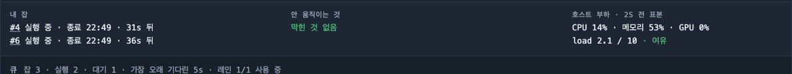
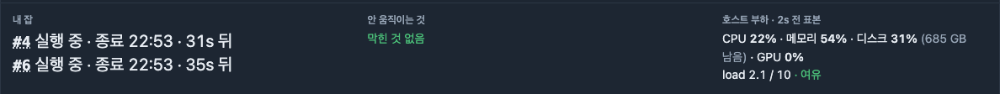
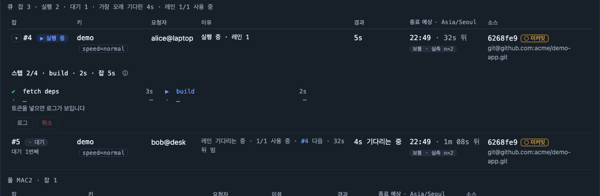
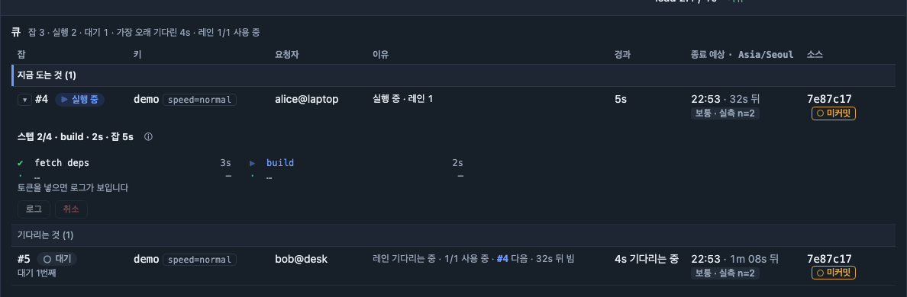
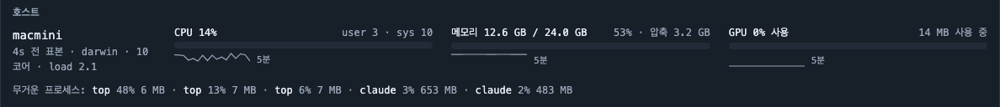
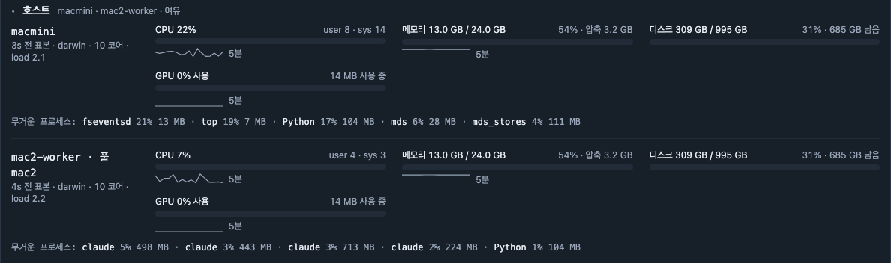
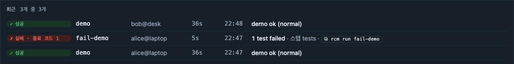
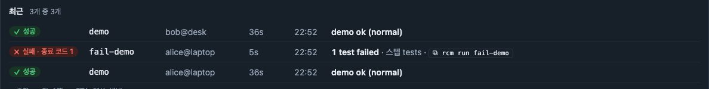
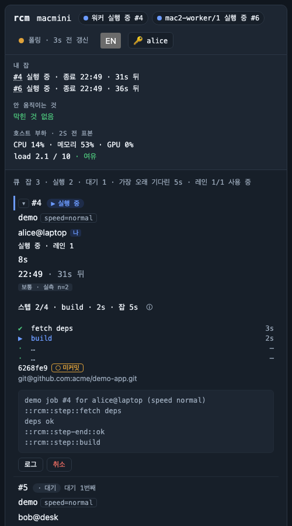
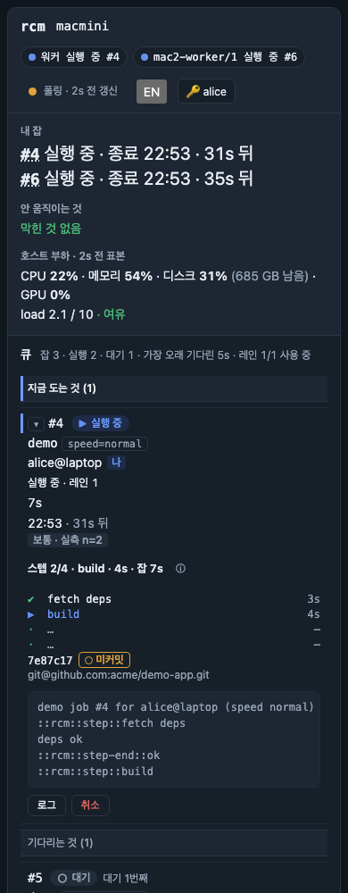

# 웹 UI 개편 전후 (2026-09-08)

> 「진짜 UI가 별로다」에서 시작해, 오너 피드백 세 건과 명세 §4 의 위계 재구성을 끝낸 기록.
> 화면은 모두 `tools/screenshots/capture.py` 가 띄운 버릴 서버에서 **같은 잡 구성으로** 찍었고,
> 두 판 다 한국어 화면이다. 호스트 이름·경로·포트·토큰은 그 도구가 지운다.
>
> | | |
> |---|---|
> | 작업 전 | `061308b` (M5d-1 머지 직후) |
> | 작업 후 | `2f65bab` (M5d 완료) |
> | PR | [#48](https://github.com/monocsp/remote_ci_monitor/pull/48) · [#51](https://github.com/monocsp/remote_ci_monitor/pull/51) · [#52](https://github.com/monocsp/remote_ci_monitor/pull/52) · [#53](https://github.com/monocsp/remote_ci_monitor/pull/53) |
>
> 명세는 `docs/m5d-workplan.md` — 완료 기준 대조표는 §7, 시작 전 측정값은 §4.7.

## 1. 「내 잡 끝났나」가 가장 크게 보인다

이 화면이 가장 자주 받는 질문이다(명세 §1). 그런데 그 답이 **13px** 로, 본문(14px)보다 한 단계
*작게* 적혀 있었다. 타이포를 산세리프로 옮기면서도 크기 단계(12/14/16/20/28)를 쓰지 않아 페이지
전체가 11~15px 에 몰려 있었던 탓이다. 위계를 굵기와 색으로만 주면 가장 중요한 것이 가장 크게
보이지 않는다 — **크기도 채널이다.**

**작업 전** — 답이 본문보다 작고, 전부 고정폭이다.

**작업 후** — 20px 산세리프. 호스트 부하에 디스크가 붙었다.

- 「내 잡」 20px, 나머지 두 칸 14px. 크기 차이가 곧 우선순위다. 잡 번호만 고정폭으로 남겼다.
- 호스트 부하에 `디스크 31% (685 GB 남음)`. 남은 양을 숫자에 **괄호로 묶었다** — 처음엔 문장 끝에
  매달았더니 바로 앞의 GPU 것처럼 읽혔다.
- 대문자 변환을 없앴다. 작업 전 라벨은 `2S 전 표본` 이었다. 한글에는 위계를 주지 못하면서 섞인
  로마자만 망가뜨린다.

## 2. 큐가 「지금 뭐가 도는지」를 말한다

표가 한 덩어리라 도는 잡과 기다리는 잡이 같은 무게로 섞여 있었다. 그리고 저장소 주소가 행마다
똑같이 되풀이되며 표를 옆으로 늘렸다.

**작업 전**

**작업 후**

- **「지금 도는 것 (1)」 · 「기다리는 것 (1)」** 두 묶음으로 개수와 함께 나눴다. 비어 있어도
  「없다」고 말하고 사라지지 않는다 — 「도는 게 없다」와 「화면이 안 떴다」가 같아 보이면 안 된다.
- 소스 칸은 커밋 해시만. 저장소 주소는 모든 행에 같은 값이라 펼친 블록으로 내렸다. 칸 폭도 못 박아
  「이유」가 남는 폭을 가져가게 했다.
- 고정폭은 식별자에만. 작업 전에는 `--mono` 가 51곳, `--sans` 가 3곳이었다.
- 대기 상태가 자기 모양을 얻었다. 전에는 `·` — 「모름」과 같은 점이었다. 지금은 빈 원 `○`.

## 3. 호스트: 없던 디스크와, 사라져 있던 워커

오너 요청은 「저장 용량이 전체 중에 얼마 남았는지」였다. 그 작업 중에 **원격 워커의 표본이 통째로
버려지고 있던 것**을 발견했다 — 작업 전 화면에 `mac2-worker` 카드가 아예 없다.

**작업 전** — 카드 하나뿐, 디스크 없음, 늘 펼쳐져 있다.

**작업 후** — 두 머신, 디스크 미터, 평소엔 접힘(아래 사진은 내용을 보이려고 펼친 상태).

- `디스크 309 GB / 995 GB · 31% · 685 GB 남음` — **잡이 실제로 쓰는 파일 시스템** 기준이다(서버는
  데이터 디렉터리, 원격 워커는 자기 것). 루트 파티션이 아니다.
- 「꽉 찼다」의 기준이 둘이다: 사용률 85% 이상, **또는** 남은 공간 10 GiB 미만. 4 TB 디스크의 90% 는
  넉넉하고 60 GB 디스크의 80% 는 스냅샷 하나를 못 푼다 — 하나만 보면 틀린다.
- 평소에는 접혀 있다. 호스트는 이 화면이 답하는 네 번째 질문인데 세로로 3분의 1을 먹고 있었다.
  제목 옆 한 줄이 상태를 말하고, 바쁘거나 표본이 낡으면 저절로 펼쳐진다.

## 4. 최근 목록: 결과 색이 행 배경처럼 번지지 않는다

성공·실패 필이 격자 칸을 꽉 채워, 결과를 알리는 색이 행 전체의 배경처럼 읽혔다.

## 5. 폰: 처음으로 진짜 폰 폭에서 봤다

폰 시험은 크롬을 `390,844` 로 띄우고 `width <= 720` 을 확인하고 있었다. 그런데 **macOS 의 크롬 창은
500px 밑으로 줄어들지 않는다.** 실제 뷰포트는 500 이었고 단언은 그냥 통과했다 — 390px 은 한 번도
검사된 적이 없었다.

**작업 전** — 실제로는 500px 이다.

**작업 후** — 진짜 390px.

- CDP(`Emulation.setDeviceMetricsOverride`)로 뷰포트를 덮어써 **정확히 390** 으로 조였다. 그 폭에서
  키·요청자 칸이 **글자와 자리를 둘 다** 갖는지 본다 — 글자만 보면 칸이 0폭으로 무너진 회귀를
  못 잡는다.
- 가로 스크롤 없음을 시험으로 잠갔다: 390·1240 × 한국어·영어 네 경우. 실패하면 무엇이 어디까지
  튀어나갔는지 찍는다.

## 6. 눈에 안 보이는 것 — 잰 값들

### 초가 튀던 것

스텝 초와 잡 초는 **서버가 상태 문서를 만든 순간의 값**이라, 다음 문서가 올 때까지 얼어 있다가 한
번에 뛰었다(폴링 10초 + SSE 합침). 오너가 본 「9초에서 갑자기 26초」가 그것이다. 이제 서버가 시작
시각(`job_started_at` · 스텝별 `started_at`)을 함께 보내고 화면이 그 기준점에서 1초마다 스스로
센다. 끝난 잡은 서버 값 그대로 고정이고, 시계 차이를 모르면 기준점 방식을 쓰지 않는다.

### 대비 — 밝은 판의 상태 필 넷이 미달이었다

필의 글자는 12px 600 이라 WCAG 의 「큰 글자」가 아니다 → 4.5:1 이 기준이다(1.4.3).

| 상태 필 | 작업 전(밝은 판) | 작업 후 | 어두운 판 |
|---|---|---|---|
| 성공 | **3.79** | 4.53 | 5.99 |
| 취소 중 | **3.72** | 4.55 | 6.07 |
| 대기 · 취소됨 | **3.83** | 4.56 | 5.55 |
| 실패 | **4.32** | 4.55 | 4.99 |
| 실행 중 | 4.69 | 4.69 | 5.14 |
| 유실 | 4.53 | 4.53 | 5.78 |

색상은 그대로 두고 밝기만 낮췄다. 어두운 판은 원래 전부 넘겼다.

### 움직임도 상태 채널

도는·대기·업로드·취소 중 잡의 상태 표시가 맥박하고, 끝난 잡은 가만히 있다. 전부
`prefers-reduced-motion` 뒤에 둔다.

| 설정 | 애니메이션이 도는 요소 |
|---|---|
| `no-preference` | 3 (도는 잡 필 둘 + 바쁜 워커 점) |
| `reduce` | **0** |

시험이 양쪽을 다 본다 — 대조군이 없으면 「움직임이 애초에 없어서 통과」가 된다.

## 7. 값을 치른 것 셋

1. **원격 워커의 표본이 통째로 버려지고 있었다.** M5d-0 이 호스트 문서에 `gpu_note_code` 를 더하면서
   워커 heartbeat 파서를 같이 고치지 않았다. 그 파서는 **모르는 키가 하나라도 있으면 표본 전체를
   거부**했다. 최신 워커의 CPU·메모리·GPU 가 그 풀의 호스트 칸에서 조용히 사라졌다 — 위 3절의 작업
   전 화면이 그 상태다. 이제 모르는 최상위 키는 버리고 표본은 살리며,
   `host_json → sample_from_json` 왕복 시험이 앞으로 키를 더할 때마다 이 문제를 즉시 드러낸다.
2. **폰에서 키·요청자 칸이 사라졌다.** 표의 칸 폭을 못 박으면서 `max-width: 0` 을 조건 없이 걸었다.
   720px 아래에서는 표의 칸이 블록이 되기 때문에 그 규칙이 칸을 지운다. 글자는 DOM 에 그대로 남아
   있어서 **사람 눈으로만 잡혔다.** 지금은 `@media (min-width: 721px)` 로 가뒀고, 폰 시험이
   「글자와 자리」를 함께 본다.
3. **폰 시험이 폰 폭에서 돌지 않고 있었다.** 5절 그대로다. 단언이 느슨해서(`<= 720`) 500px 도
   통과했다. 재고 나서야 알았다.

## 8. 남은 것

- **미출시 변경.** v0.2.4 는 타이포 개편 직전에 나갔다. `dev` 에 PR #51·#52·#53 이 미출시로 쌓여
  있다 — 릴리스 여부는 오너 결정.
- **한국어 문서 사진.** `docs/images/ui/` 는 두 사용 설명서가 함께 쓰기 때문에 영어로 찍는다.
  한국어 판 한 벌을 따로 만드는 일은 명세 §4.6-마 에 적어 뒀다(이 문서의 사진은 한국어다).
- **에이전트 워크트리.** 이 저장소에 만들어 둔 `worktree-agent-*` 가 여러 개 남아 있다.
