# Usage guide

Your first job on rcm, from an empty machine to a green exit code. Every screenshot is numbered;
the numbers in the text point at the boxes in the picture above them.

The same guide in Korean: [사용법 가이드](usage.ko.md).

**Contents** — [1. What you need](#1-what-you-need) · [2. The build machine](#2-the-build-machine) ·
[3. Your machine](#3-your-machine) · [4. Your first job](#4-your-first-job) ·
[5. Not waiting](#5-not-waiting) · [6. When it fails](#6-when-it-fails) ·
[7. Two sessions, one tree](#7-two-sessions-one-tree) · [8. The whole queue](#8-the-whole-queue-in-one-screen) ·
[9. The web page](#9-the-web-page) · [10. What to do next](#10-what-to-do-next)

## 1. What you need

- A **build machine** that stays on: a Mac or a Linux box, with Python 3.11.4 or newer.
- Any number of **session machines** — the laptops and desktops that will send work. Same Python
  requirement, and a route to the build machine (the same Wi-Fi is enough).
- Five minutes.

Install the same package on both. It has no runtime dependencies:

```sh
pipx install git+https://github.com/monocsp/remote_ci_monitor
```

## 2. The build machine

Three commands: write a config, make a token, start the server.

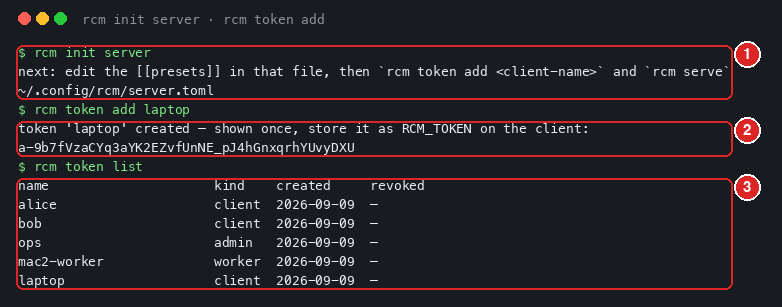

1. **`rcm init server`** writes `~/.config/rcm/server.toml` and prints where it went. Open it and
   replace the example preset with the command your team actually runs, then set
   `bind = "0.0.0.0"` if sessions come from other computers.
2. **`rcm token add laptop`** prints a token **once**. Copy it now: the server keeps only a hash of
   it and cannot show it again. One token per machine, so you can revoke one without disturbing
   the rest.
3. **`rcm token list`** shows names, kinds and dates, never secrets. `rcm token add ops --admin`
   makes an admin token; `rcm token revoke laptop` kills one.

Then start it:

```sh
rcm serve      # http://127.0.0.1:8787 · Ctrl-C stops it cleanly
```

Leave that terminal alone for now. To keep it running after you log out, use the service files in
[Operating the build machine](operating.md#run-as-a-service).

## 3. Your machine

The session needs to know two things: **where** the server is, and **who you are**. Only the first
one can be automatic, and the difference is worth knowing before you start.

On the same network you do not have to answer the first one. Ask what is out there:

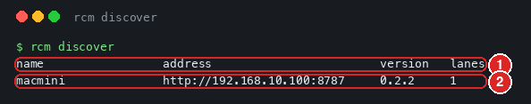

1. The header names the columns: server name, address, version, lanes.
2. One line per server. If exactly one shows up, you can leave `server` out of your config
   entirely and rcm will use it. Nothing found? The server is on another network, or its
   `advertise` is off — put its address in the file by hand.

Leaving `server` out needs rcm **0.2.2 or newer on both machines**. An older client has no
discovery at all: it stops with `no server configured` and, unlike `rcm worker`, it never compares
its version with the server's, so nothing points at the real cause. When in doubt, write the
address (`http://<build-machine>.local:8787`) — it costs nothing and always works.

**The token is not discovered, and never will be.** `rcm token add` runs on the build machine and
writes straight to the server's database; no API hands one out. Somebody has to carry it over. So
on a fresh machine this is the normal, correct state:

```
ok    server    v0.2.3 (found on this network)
FAIL  token     no token
ok    presets   gate, gate-smoke, ...
ok    pools     default (1 lane)
```

Three green rows and one red one. The server is open enough to show you its queue without a token
(`read_auth = "none"`), which makes it look finished. It is not: every write needs the token, and
copying it over is the one step left.

Write `~/.config/rcm/client.toml`. It holds a token, so it must not be readable by others:

```sh
mkdir -p ~/.config/rcm && cat > ~/.config/rcm/client.toml <<'EOF'
server = "http://macmini.local:8787"   # leave this line out on the same network
token = "<the token from step 2>"
label = "alice@laptop"                 # who the queue will show as the requester
EOF
chmod 600 ~/.config/rcm/client.toml
```

Now prove the whole path before you trust it with real work:

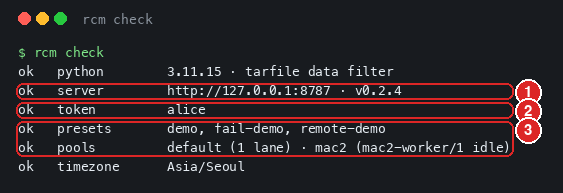

1. **server** — the address it used and the version it answered with. A version far from yours is
   worth fixing; `rcm worker` refuses a mismatch outright.
2. **token** — the name your token belongs to, and whether it is an admin token. `FAIL` here means
   the token is wrong or revoked, and nothing else will work.
3. **presets and pools** — what this server offers, and whether anything can actually run. A pool
   with no live worker is the reason jobs would sit still forever.

Every row must say `ok`. A `warn` row is a heads-up, not a failure: `rcm check` still exits 0.

## 4. Your first job

`rcm run` sends the directory you are standing in, waits, and gives you the answer.

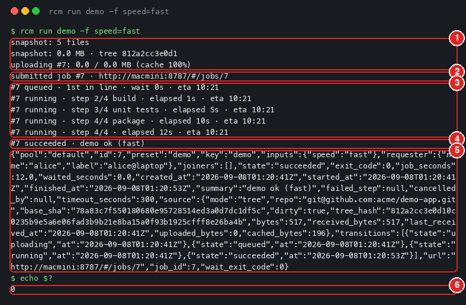

1. **The snapshot.** Everything git tracks plus untracked files that are not ignored, minus your
   `.rcmignore` patterns. It says how many files and how big, and how much it actually had to
   upload — the server keeps what it has already seen, so the second run of a barely-changed tree
   sends almost nothing.
2. **The job number and its URL.** Open that link and you are looking at this job in the web page.
3. **Progress**, one line per step, with the elapsed time and the estimated finish. The step names
   are whatever your script prints with `::rcm::step::…`.
4. **The verdict**, with the one-line summary your script printed.
5. **One JSON line on stdout** — everything about the job: state, timings, steps, the failed step
   if any. Everything above this was on stderr, so `rcm run … | jq` gets just this.
6. **The exit code**, which is what a script should branch on. 0 means it passed.

## 5. Not waiting

`--no-wait` submits and returns immediately. Come back to it whenever you like.

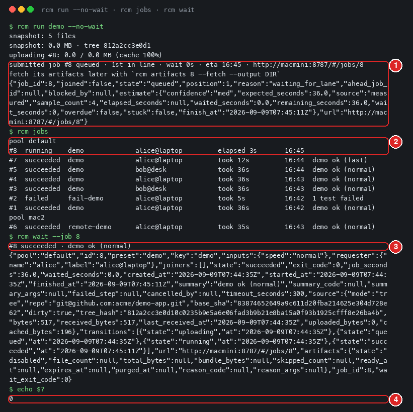

1. **Submit and go.** The JSON line tells you the job id and whether you joined an existing job.
2. **`rcm jobs`** lists what is queued, running and recently finished, grouped by pool, with who
   asked for it and how long it took.
3. **`rcm wait --job N`** attaches to a job you already have, follows it over the event stream and
   ends when the job does. Ctrl-C detaches again without stopping anything.
4. The exit code is the job's, exactly as if you had waited from the start.

`rcm logs N` prints the log, `rcm logs N --follow` keeps printing until the job ends, and
`rcm cancel N` stops it.

## 6. When it fails

A failed job is not an error in the tool, so the output stays calm and specific.

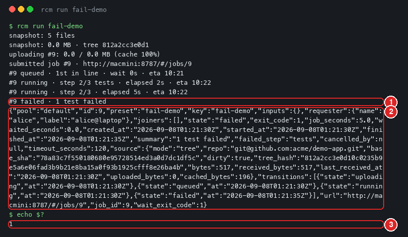

1. **The verdict line** names the step that failed and the summary your script printed.
2. **The JSON** carries `failed_step`, `exit_code` and the per-step timings, so a wrapper script
   can report which stage broke without scraping the log.
3. **Exit 1 means the job failed.** Exit 2 is cancelled or timed out. Exit 3 is *unknown* — the
   server restarted, or you could not reach it — and it is never reported as a failure. If your CI
   treats 3 as red, it will be red for the wrong reason.

## 7. Two sessions, one tree

Two people testing the same commit should not queue twice.

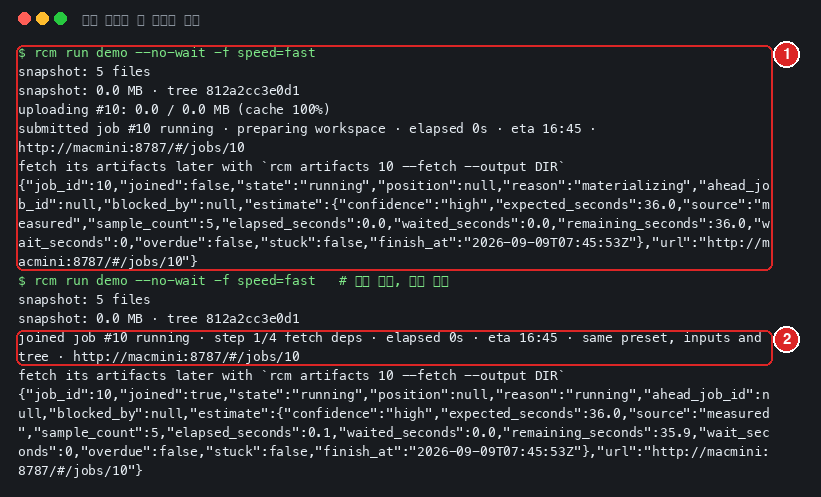

1. The first submission creates the job.
2. The second one, with the same preset, the same inputs and the same tree, **joins** it: no second
   run, no second wait, the same result for both. `--no-join` opts out, and cancelling a joined job
   only removes you from the list.

## 8. Getting the files back

A job that regenerates files leaves them on the build machine. `--fetch-artifacts` brings them
home, into the same paths in the tree you submitted.

```sh
rcm run goldens --fetch-artifacts
```

```
artifacts: 64 files · 12.4 MB
artifacts: new 0 · changed 12 · unchanged 51 · conflicted 1
artifacts: wrote 12, unchanged 51, conflicted 1
```

1. The preset has to declare what to collect (`artifacts = ["test/**/goldens/*.png"]` — see
   [Configuration](configuration.md#getting-files-back-out-of-a-job)). Without it nothing is
   collected and nothing is fetched; that is not an error.
2. **A file you edited while waiting is never overwritten.** It is counted `conflicted` and left
   as it is. `--force` overwrites those too. `--dry-run` prints the table and writes nothing.
3. The last line separates what was compared from what was written. For a golden update, `wrote`
   is the answer you came for.
4. Once every file is written, your session tells the server. If nobody joined the job, the bundle
   is deleted right then; otherwise it waits 24 hours so the others can fetch it too.

Submitted with `--no-wait`, or want them somewhere else?

```sh
rcm artifacts 412                          # what is there
rcm artifacts 412 --fetch --output ./out   # write it into a directory you name
```

## 9. The whole queue in one screen

`rcm top` is the one command to leave open in a terminal.

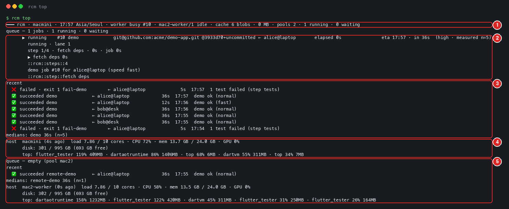

1. **The header**: which server, what time it is there, what the workers are doing, how big the
   snapshot cache is.
2. **The queue**: what is running with its current step, and what is waiting with its position and
   ETA. The reason a job is not moving is stated, never guessed.
3. **Recent results and medians** — how long this preset usually takes, from real runs, which is
   where the ETAs come from.
4. **The host**: load, CPU, memory, disk, GPU and the top processes. This is how you tell "stuck" from
   "the machine is busy".
5. **Other pools** get their own section, so a second build machine is visible from the same
   screen.

`rcm top --watch 5` refreshes every five seconds; `rcm top --json` is for scripts.

## 10. The web page

Open `http://<build-machine>:8787/` — nothing to install, and it works on a phone.

### The header

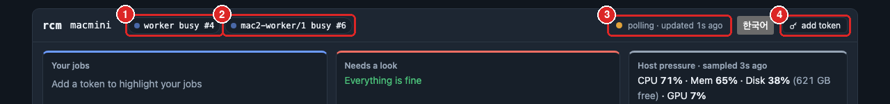

1. The **local worker** lane and what it is running.
2. Each **remote worker**, with its pool and job. A worker that stopped answering shows `down`.
3. The **connection state**. `live` means the event stream is open; `polling` means it fell back,
   with the age of the last successful update.
4. **🔑** takes your token. It is kept in this browser only, never in the URL.

### The queue

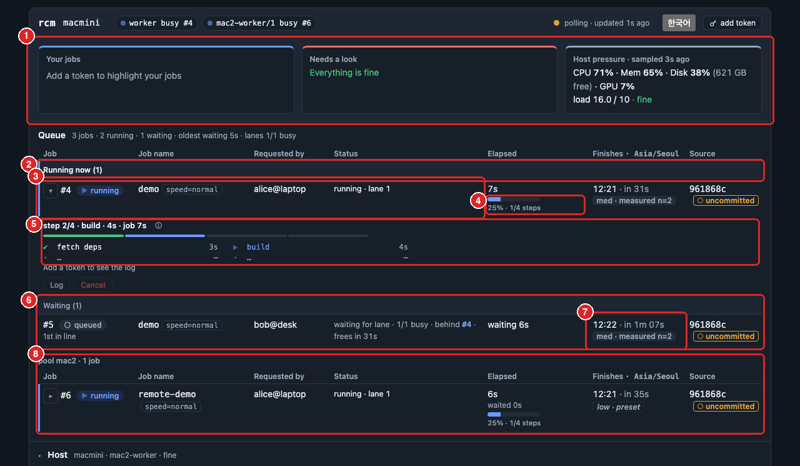

1. **Three answers at a glance**: your jobs, anything not moving, and how hard the machine is
   working.
2. **Running now, and waiting**, each with a count. An empty group says so rather than vanishing,
   so "nothing is running" never looks the same as "the page did not load".
3. **The running job**, with who asked for it and what tree it is testing. Collapse it with **▾**
   and the current step moves into the reason column as `step 2/4 build 2s`, so a folded row still
   says what is happening.
4. **Its steps**, in order, with the finished ones ticked and the current one timed. The seconds
   count up as you watch; they do not sit still and then jump when the page refreshes.
5. **A waiting job**, with its position in the queue.
6. **The ETA and its confidence.** `high` is a median of five or more real runs; `low` is a guess
   from the preset; `—` means it will not pretend to know.
7. **Another pool**, with its own workers and queue. The **Source** column shows the commit only;
   the repository it came from is in the expanded block, since every row usually repeats it.

### Your jobs

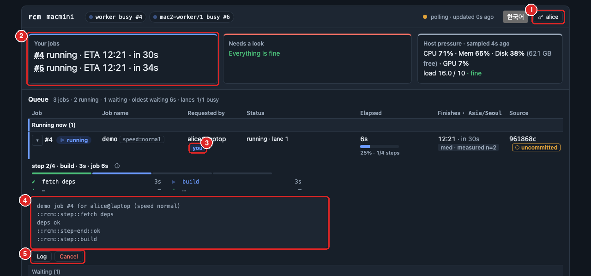

1. Paste the token behind **🔑**. The button then shows the token's name.
2. **Your jobs** in the summary counts what you asked for, including jobs you joined.
3. Your rows are marked **you**.
4. The last lines of the log appear under your running job, updating as it goes.
5. **Log** opens the whole thing; **Cancel** stops the job. You only ever see these on your own
   jobs, unless your token is an admin one.

### The log drawer

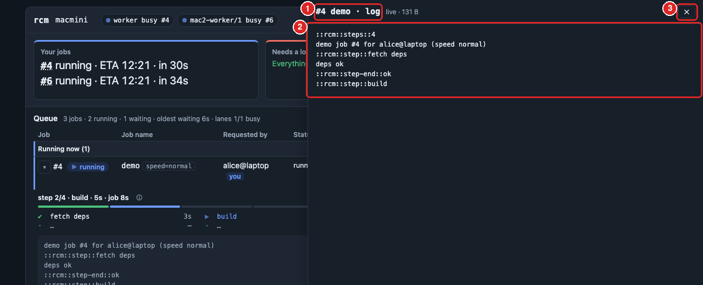

1. Which job you are reading.
2. The log itself, following the job while it runs.
3. Close, or press Escape.

### Recent results

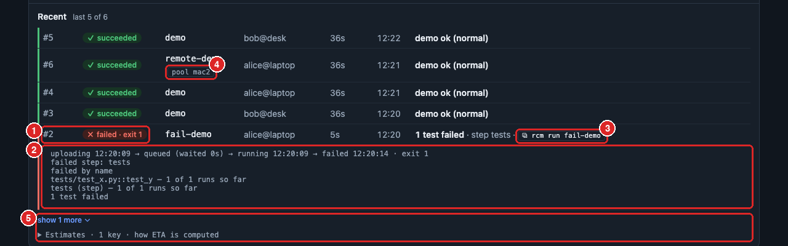

1. The **result** of every recent job.
2. Click a failed one to see **which step failed** and what it printed.
3. **The command that reproduces it**, ready to copy.
4. Which **pool** it ran in.
5. **Estimates** explains where the ETAs come from — how many samples, how old.

### The host card

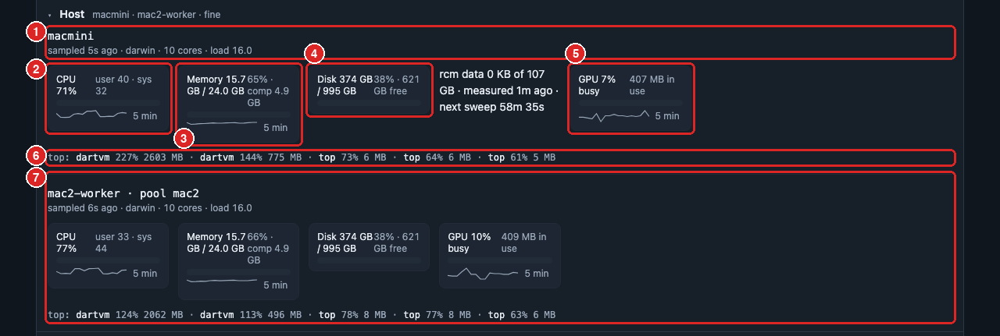

The section is folded by default — it opens itself when something is wrong (a machine is busy or
its sample has gone stale), and the one-line summary beside the heading always says which machines
are reporting and how they are doing. Open or close it yourself and that choice is remembered.

1. The machine and **how old the sample is**. Anything stale is labelled, never quietly shown as
   current.
2. **CPU**, 3. **memory**, 4. **disk** and 5. **GPU**. CPU, memory and GPU carry five minutes of
   history; a machine without a readable GPU says so instead of showing zero. Disk is the
   filesystem the jobs write to, and how much is left is spelled out beside the bar — a build
   fails on a full disk long before it fails on a busy one.
6. **The heaviest processes**, which is usually enough to see what else is competing for it.
7. Each **remote worker** gets its own card under its pool.

### When a worker stops

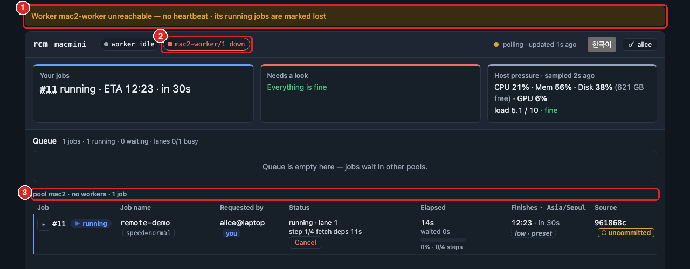

1. A **banner** says what happened.
2. The worker's pill turns **down**.
3. Its pool is marked as having no worker, and jobs there wait with that reason and **no ETA** —
   nothing pretends they are about to start. They are not resumed automatically: submit again once
   the worker is back.

### On a phone

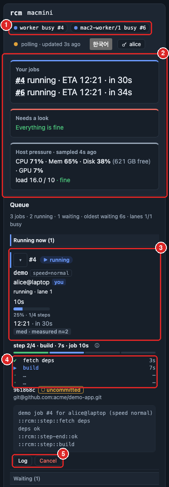

1. Workers, 2. the summary, 3. a job as a card, 4. its steps and 5. the buttons — one column, same
   information, no horizontal scrolling.

## 11. What to do next

- Write the preset your team actually needs: [Configuration](configuration.md).
- Run two jobs at once. Set `[server] lanes = 2` — lane 2 only picks up work while the machine has
  CPU to spare, so it is safe to try. If the queue says `held by load`, that is the machine telling
  you it is full: [Parallel lanes](configuration.md#parallel-lanes-without-overloading-the-machine).
- Make your script print step markers, so the queue shows progress instead of a spinner.
- Wrap `rcm run` in your CI script and branch on the exit code. `examples/session/ci-gate.sh` is a
  working example.
- Keep the server alive across reboots, and read the security notes before you open it to a
  network: [Operating the build machine](operating.md).
